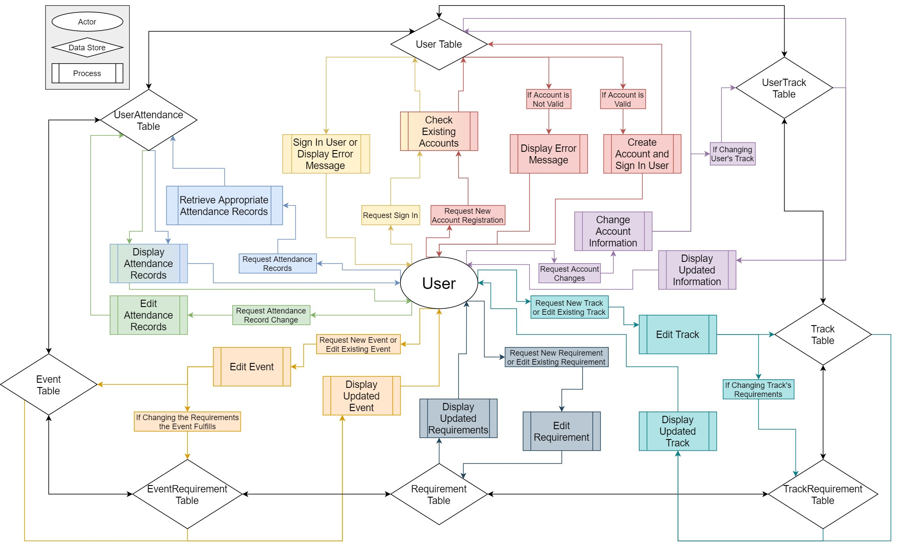

# iAttend Development Blog

[Home](./README.md)

## Highly Unlikely Risk Actually Happens
### 03/18/2020
In the midst of Spring Break for UMU students, COVID-19 has devasted social norms and life as the world knows it, at least temporarily. This has caused class restructuring and rescheduling for everything related to the University, including transitioning to entirely online sans face-to-face communication for coursework and, yes, development. While there are significant advantages to working together in the same space, the TFL team is ready to take on the challenge of remote work. None of the project depends on being on campus, so the team is ready to get back into the project post - Spring Break and this starts with the design! The database is the next part of the project, and it is the goal to have this done as soon as possible. There is also work being done to complete the CSS and design of the web portal, so stay tuned for mock-ups! 

## Documentation and Training
### 03/02/2020
It has been extremely helpful having the development infrastructure set up. As a team, we have been able to learn about the tools and environment we are using. The design implementation for the web app, for example, is a Model View Controller template from Visual Studio. We have spent time setting up a test environment to practice web development in an MVC model, and it has been incredibly informative.

We are also designing the database! The tables are being created in pgAdmin4, the database management system for PostgreSQL that we have connected to our database in the cloud. All the connectivity is something that has been difficult to wrap our heads around, but a great learning experience and something that will pay off in the finished product.

We also have the rough draft of our Design Document 1 [here](./DD1_ThreeFuriousLocomotives.pdf)

## Planning, planning, planning
### 02/26/2020
This week has been a week of setup and scheduling. Not the most exciting thing in the world, as development has not started yet. This, however, is due to the fact that the week has been dedicated to creating a Gantt chart for our development work, and integrating a new Kanban board on GitHub Projects! This setup will allow us to easily view our schedule, and assign issues and track them accordingly. The Preliminary Project Schedule has been posted, and is accessible [here](./PPS-ThreeFuriousLocomotives.pdf).

All the IDE's have been set up and configured to synchronize with GitHub. The Azure web app service is spun up, as is the PostgreSQL server. A test PostgreSQL server has been deployed as well, so that we have a database environment to test with. We are now finally ready for development.... here we go.

See you on the other side!

## Setup progress
### 02/17/2020
This week, the TFL team has made some significant progress with the iAttend planning and structing phases. The Software Requirements Specification has been finalized, and the schedule for development has been completed, along with the specific tasks and timetables.

On the structural side of things, the workflow has been set up. The Azure App Service has been started up, and will be used for the web portal. The PostgreSQL database service has also been spun up in the Azure cloud, under a unified Resource Group accessible by the team.

As for as an IDE, the team will be using Visual Studio Enterprise. This will allow the team to unify the entirety of the iAttend system development in one solution which is synced to the GitHub repository. From there, the team can develop different parts of the project in parallel and take advantage of the tools and templates available. These templates include the ASP.NET Core Web Application MVC template and the Xamarin Forms Cross-Platform Mobile Application development template. Both are started as projects under the same VSE solution, and already configured to sync with the remote repository.

The GitHub has also moved to allow for a fresh start, considering the new workflow setup. It is located [here](https://github.com/majarman/iAttendTFL). There is a master branch for production, a testing branch, a gh-pages branch for this site, and there will be feature branches as feature development takes place. This will allow the team to checkout new branches from production, makes changes, merge to the testing branch, and on completion of QA, merge the feature branch into production. This workflow is organized and efficient, and will serve the project well.

Thanks for checking in! The team will post the timetable once confirmed and finalized here. Make sure to check back next week to see the initial development!

EDIT (02-17-2020): Check out our [press release](./iAttendPressRelease1.pdf), courtesy of Matthew Dutt!

## Birth of a Blog!
### 02/08/2020
Thank you for your interest in our development of the iAttend project! This page will be dedicated to blog posts concerning the development progress of the project. There will be a weekly post live every Monday describing the progress that is being made, along with any news or changes.

So far, the TFL team has made significant progress in nailing down the requirements and specifications of the document. Draft ii of the Software Requirements Specification document describes this work. The team has also settled on a few design elements, including:

- Use of the Azure cloud to host the server, along with the built in Kestrel web server,
- PostgreSQL as the database,
- ASP.NET as the server side scripting language,
- Visual Studio as the IDE, with built in support for the .NET frameworks,
- Xamarin as the cross-platform mobile development framework,
- GitHub as the sole project management and central code repository,
- and GitHub pages as our project website.

The TFL team looks forward to making significant progress in the coming weeks getting the infrastructure set up and configured. More news on development is coming soon, along with a timetable for features to be released. Stay tuned!
